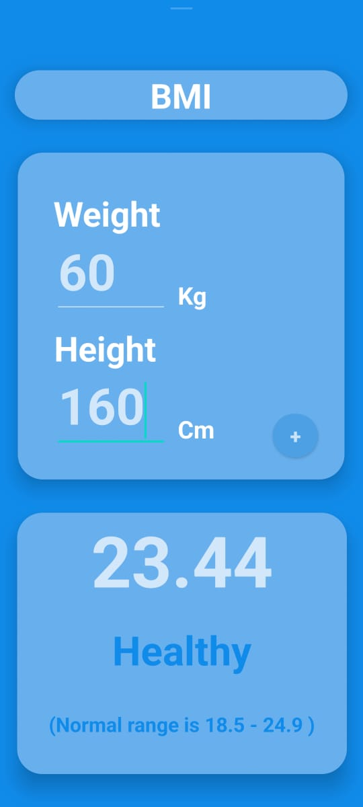

# BMI Calculator App

This is a simple BMI (Body Mass Index) calculator app developed for Android devices. The app allows users to calculate their BMI based on their height and weight inputs.

## Features

- Calculate BMI: Users can input their height and weight to calculate their BMI.
- BMI Classification: The app provides a BMI classification to indicate whether the user is underweight, normal weight, overweight, or obese.

## Prerequisites

Before running the app, make sure you have the following:

- Android Studio: The latest version of Android Studio installed on your computer.

## Installation

1. Clone this repository to your local machine using the following command:
  ```bash
  https://github.com/Paulraj916/BMI.git
  ```
2. Open Android Studio and select "Open an existing Android Studio project."
3. Navigate to the cloned repository directory and open it.
4. Build and run the project on an emulator or physical Android device.

## Usage

1. Launch the BMI Calculator app on your Android device.
2. Enter your height in centimeters.
3. Enter your weight in kilograms.
4. Tap the "Calculate" button to calculate your BMI.
5. View your calculated BMI and the corresponding classification.

## Contact

If you have any questions or suggestions, feel free to reach out to me at [pauldanial916@outlook.com](pauldanial916@outlook.com).

## Sample image

